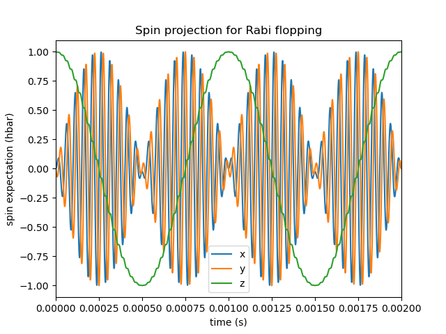
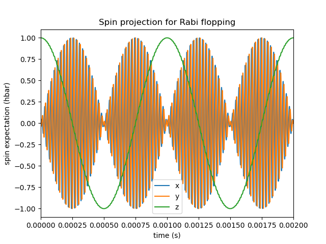
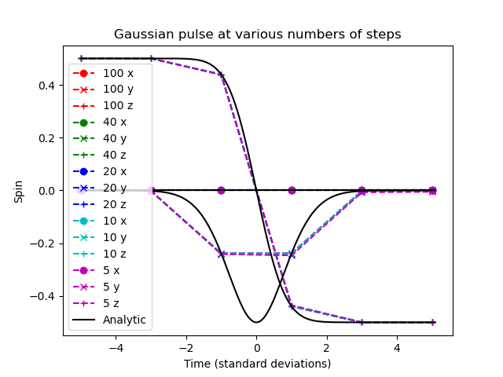
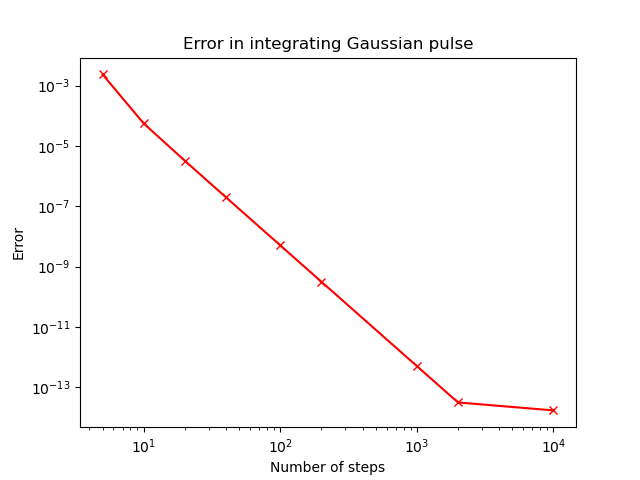
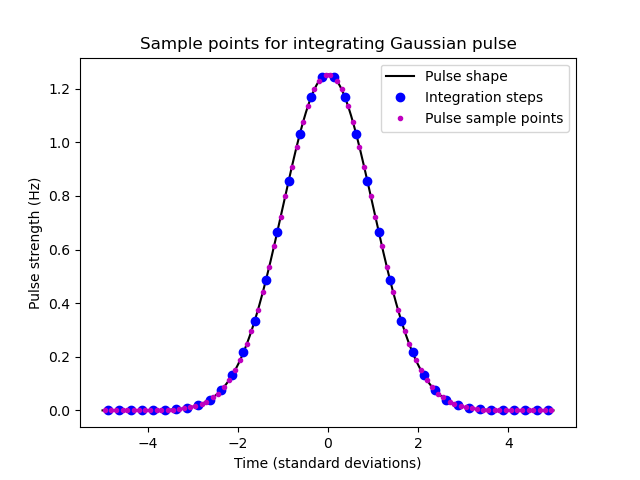

.. _examples:

Examples of use
===============

Example 1: Spin half Larmor precession
--------------------------------------

Full code
.........

.. code-block:: python

   import spinsim
   import numpy as np
   import matplotlib.pyplot as plt

   def get_field_larmor(time_sample, field_modifier, field_sample):
      field_sample[0] = 0            # Zero field in x direction
      field_sample[1] = 0            # Zero field in y direction
      field_sample[2] = 1000         # Split spin z eigenstates by 1kHz

   simulator_larmor = spinsim.Simulator(get_field_larmor, spinsim.SpinQuantumNumber.HALF)

   state_init = np.asarray([1/np.sqrt(2), 1/np.sqrt(2)], np.cdouble)

   results_larmor = simulator_larmor.evaluate(0, 0e-3, 100e-3, 100e-9, 500e-9, state_init)

   plt.figure()
   plt.plot(results_larmor.time, results_larmor.spin)
   plt.legend(["x", "y", "z"])
   plt.xlim(0e-3, 2e-3)
   plt.xlabel("time (s)")
   plt.ylabel("spin expectation (hbar)")
   plt.title("Spin projection for Larmor precession")
   plt.show()

Explanation
...........

The most basic system that :mod:`spinsim` can simulate is that of Larmor precession of a spin half system. Here, the two spin z projection eigenstates are split by a source potential :math:`f_L`, measured in Hz.

.. note::
   In :mod:`spinsim`, energies are written in dimensions of frequency, in units of Hz, where the value used is the frequency equivalent to the energy given by the Plank-Einstein relation, :math:`f = \frac{E}{h}`, with :math:`h` being Plank's constant.

When the system is initialised in a state of definite spin z projection, it gains a phase over time. However, if the system is started in a superposition of these states, the expected spin projection (Bloch) vector will precess around the :math:`z` axis at a rate of :math:`f_L`.

The first thing we need to do is import the correct packages for the example. As well as :mod:`spinsim` for simulations, we will use :mod:`numpy` to work with arrays, and :mod:`matplotlib.pyplot` to plot our results.

.. code-block:: python

   import spinsim
   import numpy as np
   import matplotlib.pyplot as plt

When set to spin half mode, the :mod:`spinsim` package solves time dependent Schroedinger Equations of the form

.. math::
   \frac{\mathrm{d}}{\mathrm{d}t}\psi(t) = -i 2\pi (f_x(t) J_x + f_y(t) J_y + f_z(t) J_z) \psi(t),

where :math:`i^2 = -1`, :math:`\psi(t) \in \mathbb{C}^2`, and the spin half spin projection operators are given by

.. math::
   \begin{align*}
      J_x &= \frac12\begin{pmatrix}
         0 & 1 \\
         1 & 0
      \end{pmatrix},
      &J_y &= \frac12\begin{pmatrix}
         0 & -i \\
         i &  0
      \end{pmatrix},
      &J_z &= \frac12\begin{pmatrix}
         1 &  0 \\
         0 & -1
      \end{pmatrix}.
   \end{align*}

The source of the system is the collection of energy functions :math:`f_x(t), f_y(t), f_z(t)`, with :math:`t` in units of s and :math:`f` in units of Hz that control the dynamics of the system. The user must define a function that returns a sample of these source functions when a sampling time is input.

To continue with our example, the Larmor system follows a Schroedinger equation of

.. math::
   \frac{\mathrm{d}}{\mathrm{d}t}\psi(t) = -i 2\pi f_L J_z \psi(t),

so

.. math::
   \begin{align*}
      f_x(t) &= 0,&
      f_y(t) &= 0,&
      f_z(t) &= f_L.
   \end{align*}

Let's pick :math:`f_L = 1\mathrm{kHz}`. We can write this as a python function as follows:

.. code-block:: python

   # Define a numba.cuda compatible source sampling function
   def get_field_larmor(time_sample, field_modifier, field_sample):
      field_sample[0] = 0            # Zero source in x direction
      field_sample[1] = 0            # Zero source in y direction
      field_sample[2] = 1000         # Split spin z eigenstates by 1kHz

This function has three inputs. `time_sample` and `field_sample` are the equivalent of :math:`t` and :math:`(f_x, f_y, f_z)` from before. In particular, `field_sample` is a numpy array of doubles, with indices 0, 1, 2 representing for indices :math:`x, y, z` respectively. `field_modifier` is a secondary input to the function, which we will explore in the next example.

We can then construct an object of :class:`spinsim.Simulator` to return an integrator with this specific function built in.

.. code-block:: python

   # Return a solver which uses this function
   simulator_larmor = spinsim.Simulator(get_field_larmor, spinsim.SpinQuantumNumber.HALF)

This integrator is compiled for specific devices determined by the key word argument `device`, with choices from the values of the :obj:`enum.Enum`, :obj:`spinsim.Device`. For example, if the user wants to run simulations using an Nvidia Cuda GPU, they can instead write

.. code-block:: python

   # Return a solver which uses this function
   simulator_larmor = spinsim.Simulator(get_field_larmor, spinsim.SpinQuantumNumber.HALF, device.CUDA)

By default, the :class:`spinsim.Simulator` instance checks whether or not Cuda devices are available, and if one is, it compiles the simulation code for Cuda. Otherwise, it compiles the simulation code for CPU (parallelised). The compilation is done by the :mod:`numba` package. This means that the function `get_field` supplied by the user must be compilable for the desired device using :mod:`numba`. See the documentation for :obj:`spinsim.Device` for more information on the restrictions this results in.

The constructor of :class:`spinsim.Simulator` contains many other options that can be used to customise which features are used by the integrator.

The next step is to define some simulation parameters, as well as the input and output. Firstly, we must decide on some time steps that are to be used. `time_step_coarse` defines the resolution of the output time series for the time evolution operator, state and spin. `time_step_fine` determines the internal time step of the integrator. `time_step_coarse` must be an integer multiple of `time_step_fine`. We also need to define the times when the experiment starts and ends. Below we have chosen to have a `time_step_fine` of 10ns, a `time_step_coarse` of 100ns, a start time of 0ms, and an end time of 100ms. We also need to define an initial state for the spin system. We choose an eigenstate of the :math:`J_x` operator, as we expect that to precess as it evolves through time. Now that everything is set up, the time evolution operator can be found between each sample using our object `simulator_larmor`.

We can now run the simulation.

.. code-block:: python

   # Evaluate the state over time, using our settings
   state_init = np.asarray([1/np.sqrt(2), 1/np.sqrt(2)], np.cdouble)

   results_larmor = simulator_larmor.evaluate(0, 0e-3, 100e-3, 100e-9, 500e-9, state_init)

Has this worked? We can plot the results using :mod:`matplotlib.pyplot` (zoomed in to show details),

.. code-block:: python

   # Plot result
   plt.figure()
   plt.plot(results_larmor.time, results_larmor.spin)
   plt.legend(["x", "y", "z"])
   plt.xlim(0e-3, 2e-3)
   plt.xlabel("time (s)")
   plt.ylabel("spin expectation (hbar)")
   plt.title("Spin projection for Larmor precession")
   plt.show()

which results in

.. image:: ../../images/example_1_1.png

Here we see that indeed, the bloch vector is precessing anticlockwise at a frequency of 1kHz around the positive z axis.

Example 2: Time dependent field and sweeping parameters
-------------------------------------------------------

Full code
.........

.. code-block::

   import spinsim
   import numpy as np
   import matplotlib.pyplot as plt
   import math

   def get_field_rabi(time_sample, field_modifier, field_sample):
      # Dress atoms from the x direction, Rabi flopping at 1kHz
      field_sample[0] = 2000*math.cos(math.tau*20e3*field_modifier*time_sample)
      field_sample[1] = 0                        # Zero field in y direction
      field_sample[2] = 20e3*field_modifier     # Split spin z eigenstates by 700kHz
      field_sample[3] = 0                        # Zero quadratic shift, found in spin one systems

   simulator_rabi = spinsim.Simulator(get_field_rabi, spinsim.SpinQuantumNumber.ONE)

   state_init = np.asarray([1, 0, 0], np.cdouble)

   result0 = simulator_rabi.evaluate(1, 0e-3, 100e-3, 100e-9, 500e-9, state_init)

   plt.figure()
   plt.plot(result0.time, result0.spin)
   plt.legend(["x", "y", "z"])
   plt.xlim(0e-3, 2e-3)
   plt.xlabel("time (s)")
   plt.ylabel("spin expectation (hbar)")
   plt.title("Spin projection for Rabi flopping")
   plt.show()

   result1 = simulator_rabi.evaluate(2, 0e-3, 100e-3, 100e-9, 500e-9, state_init)

   plt.figure()
   plt.plot(result1.time, result1.spin)
   plt.legend(["x", "y", "z"])
   plt.xlim(0e-3, 2e-3)
   plt.xlabel("time (s)")
   plt.ylabel("spin expectation (hbar)")
   plt.title("Spin projection for Rabi flopping")
   plt.show()

Explanation
...........

Now that we have confirmed that the most basic quantum system can be simulated using :mod:`spinsim`, we can explore a more complicated system with varying parameters.

Again, we import some packages, now including the :mod:`math` package.

.. code-block:: python

   import spinsim

   import numpy as np
   import matplotlib.pyplot as plt

   import math

Let's first introduce the Rabi system. As before, we split the energy levels of the spin system (which is now three levels), with an energy difference :math:`f_L` between each consecutive level. Again, if started in an eigenstate of :math:`J_x`, the expected spin will precess anticlockwise around the positive z axis. Radiation can be applied to the system to drive transitions between the spin states. For this to work, radiation must be resonant (or close to resonant) with the energy splitting (ie, its frequency of oscillation must be close to :math:`f_L`). If the system starts with the expected spin pointing completely up, this radiation will drive the system to point completely down. It will then drive the system back up, and the cycle repeats. This happens at a rate of half of the amplitude of the radiation (assuming perfect resonance), which is called the Rabi frequency :math:`f_R`, and the cycling is called Rabi flopping. The Schroedinger equation of the Rabi system is

.. math::
   \frac{\mathrm{d}}{\mathrm{d}t}\psi(t) = -i 2\pi (2 f_R \cos(2\pi f_L t) J_x + f_L J_z) \psi(t).

In general, :mod:`spinsim` can solve Schroedinger equations of the form

.. math::
   \frac{\mathrm{d}}{\mathrm{d}t}\psi(t) = -i 2\pi (f_x(t) J_x + f_y(t) J_y + f_z(t) J_z + f_q(t) Q) \psi(t).

where now :math:`\psi(t) \in \mathbb{C}^3`, and the spin one operators are given by

.. math::
   \begin{align*}
      J_x &= \frac{1}{\sqrt{2}}\begin{pmatrix}
         0 & 1 & 0 \\
         1 & 0 & 1 \\
         0 & 1 & 0
      \end{pmatrix},&
      J_y &= \frac{1}{\sqrt{2}}\begin{pmatrix}
         0 & -i &  0 \\
         i &  0 & -i \\
         0 &  i &  0
      \end{pmatrix},\\
      J_z &= \begin{pmatrix}
         1 & 0 &  0 \\
         0 & 0 &  0 \\
         0 & 0 & -1
      \end{pmatrix},&
      Q &= \frac{1}{3}\begin{pmatrix}
         1 &  0 & 0 \\
         0 & -2 & 0 \\
         0 &  0 & 1
      \end{pmatrix}.
   \end{align*}

:math:`J_x, J_y, J_z` are regular spin operators, and :math:`Q` is a quadratic operator, proportional to :math:`Q_{zz}` as defined by :cite:`hamley_spin-nematic_2012`, and :math:`Q_0` as defined by :cite:`di_dipolequadrupole_2010`.

Just as before, we must define a source function, this time being time dependent.

.. code-block:: python

   def get_field_rabi(time_sample, field_modifier, field_sample):
      # Dress atoms from the x direction, Rabi flopping at 1kHz
      field_sample[0] = 2000*math.cos(math.tau*20e3*time_sample)
      field_sample[1] = 0      # Zero source in y direction
      field_sample[2] = 20e3   # Split spin z eigenstates by 20kHz
      field_sample[3] = 0      # Zero quadratic shift, found in spin one systems

This time there is a fourth entry in `field_sample`, which represents the quadratic shift :math:`f_q(t)`. Here we have chosen a Larmor frequency :math:`f_L` of 20kHz, and a Rabi frequency :math:`f_R` of 1kHz.

.. warning::
   Remember, these functions must be :func:`numba.cuda.jit()` compilable. The following code will not work due to the use of :mod:`numpy` functions and constants:

   .. code-block:: python

      def get_field_rabi(time_sample, field_modifier, field_sample):
         # Dress atoms from the x direction, Rabi flopping at 1kHz
         field_sample[0] = 2000*np.cos(np.tau*20e3*time_sample)
         field_sample[1] = 0       # Zero source in y direction
         field_sample[2] = 20e3    # Split spin z eigenstates by 20kHz
         field_sample[3] = 0       # Zero quadratic shift, found in spin one systems

Before we move on, suppose that we want to execute multiple similar simulations. For example, we could run the current simulation, then one that is exactly the same, but with double the Larmor frequency :math:`f_L`. One could do this by hard coding another source function with this change and then compiling another solver, but this takes time and is inefficient. Instead, we can use the parameter `field_modifier`.

.. code-block:: python

   def get_field_rabi(time_sample, field_modifier, field_sample):
      # Dress atoms from the x direction, Rabi flopping at 1kHz
      field_sample[0] = 2000*math.cos(math.tau*20e3*field_modifier*time_sample)
      field_sample[1] = 0                        # Zero source in y direction
      field_sample[2] = 20e3*field_modifier     # Split spin z eigenstates by 20kHz
      field_sample[3] = 0                        # Zero quadratic shift

The value of each `field_modifier` can be input whenever the integration function is called. In general, this can be used to sweep through values for any number of simulations, saving compile time.

Let's build our simulator object, now spin one.

.. code-block:: python

   # Return a solver which uses this function
   simulator_rabi = spinsim.Simulator(get_field_rabi, spinsim.SpinQuantumNumber.ONE)

We set up some of the parameters as before, and we are now ready to execute. Note that, `field_modifier` is the first parameter. Here it is set to 1 for a Larmor frequency :math:`f_L` of 20kHz.

.. code-block:: python

   # Find the time evolution operator using our settings
   state_init = np.asarray([1, 0, 0], np.cdouble)

   results0 = simulator_rabi.evaluate(1, 0e-3, 100e-3, 100e-9, 500e-9, state_init)

Finally we can plot our results.

.. code-block:: python

   # Plot result
   plt.figure()
   plt.plot(results0.time, results0.spin)
   plt.legend(["x", "y", "z"])
   plt.xlim(0e-3, 2e-3)
   plt.xlabel("time (s)")
   plt.ylabel("spin expectation (hbar)")
   plt.title("Spin projection for Rabi flopping")
   plt.show()

which gives

Notice the spin z projection cycling (Rabi flopping) at a rate of 1KHz, while the spin x and y projections are cycling between each other (Larmor precessing) at a rate of 20kHz. Using the rotating wave approximation, the spin z projection can be thought of as a sine wave. However, when these approximations are not used, one obtains these artifacts that we see on the spin z projection, known as beyond rotating wave effects.

Finally, let's run another experiment using the same compiled function. This will run faster than last time, as it does not need to be compiled a second time. Notice that here we set `field_modifier` to 2, which should double the Larmor frequency :math:`f_L`.

.. code-block:: python

   # Find the time evolution operator using our settings
   results1 = simulator_rabi.evaluate(2, 0e-3, 100e-3, 100e-9, 500e-9, state_init)

   # Plot result
   plt.figure()
   plt.plot(results1.time, results1.spin)
   plt.legend(["x", "y", "z"])
   plt.xlim(0e-3, 2e-3)
   plt.xlabel("time (s)")
   plt.ylabel("spin expectation (hbar)")
   plt.title("Spin projection for Rabi flopping")
   plt.show()

which results in

See that the spin projections are similar to last time, except that the Larmor precession is now at 40KHz.

Example 3: Gaussian Pi pulse and sampling
-----------------------------------------

Full code
.........

.. code-block:: python

   import spinsim
   import math
   import numpy as np
   import matplotlib.pyplot as plt
   import datetime as dtm

   time_now_string = dtm.datetime.now().strftime("%Y%m%dT%H%M%S")

   def gaussian_pulse(time, modifier, pulse):
      pulse[0] = (math.pi/math.sqrt(math.tau))*math.exp(-0.5*(time**2))/math.tau
      pulse[1] = 0.0
      pulse[2] = 0.0

   def cumulative_gaussian(t):
      return 0.5*(1 + math.erf(t/math.sqrt(2.0)))

   plt.figure()
   pulse_sample = np.empty(3, np.float64)

   time_continuous = np.arange(-5.0, 5.0005, 1e-3)
   pulse_continuous = []
   for time_sample in time_continuous:
      gaussian_pulse(time_sample, 0, pulse_sample)
      pulse_continuous += [pulse_sample[0]]
   pulse_continuous = np.asarray(pulse_continuous)
   plt.plot(time_continuous, pulse_continuous, "k-")

   time_step = 0.25
   time_midpoint = 0.5*time_step + np.arange(-5.0, 5.0, time_step)
   pulse_midpoint = []
   for time_sample in time_midpoint:
      gaussian_pulse(time_sample, 0, pulse_sample)
      pulse_midpoint += [pulse_sample[0]]
   pulse_midpoint = np.asarray(pulse_midpoint)
   plt.plot(time_midpoint, pulse_midpoint, "bo")

   time_quadrature = []
   pulse_quadrature = []
   for time_sample in time_midpoint:
      gaussian_pulse(time_sample - 0.5*time_step/math.sqrt(3), 0, pulse_sample)
      time_quadrature += [time_sample - 0.5*time_step/math.sqrt(3)]
      pulse_quadrature += [pulse_sample[0]]

      gaussian_pulse(time_sample + 0.5*time_step/math.sqrt(3), 0, pulse_sample)
      time_quadrature += [time_sample + 0.5*time_step/math.sqrt(3)]
      pulse_quadrature += [pulse_sample[0]]
   time_quadrature = np.asarray(time_quadrature)
   pulse_quadrature = np.asarray(pulse_quadrature)
   plt.plot(time_quadrature, pulse_quadrature, "m.")

   plt.xlabel("Time (standard deviations)")
   plt.ylabel("Pulse strength (Hz)")
   plt.legend(
      [
         "Pulse shape",
         "Integration steps",
         "Pulse sample points"
      ]
   )
   plt.title("{}\nSample points for integrating Gaussian pulse".format(time_now_string))
   plt.savefig("gaussian_pulse_sample.png")
   plt.savefig("gaussian_pulse_sample.pdf")
   plt.show()

   plt.figure()

   time = np.arange(-5.0, 5.1, 2.0)
   state_analytic = np.asarray([[math.cos(0.5*math.pi*cumulative_gaussian(t)), -1j*math.sin(0.5*math.pi*cumulative_gaussian(t))] for t in time], dtype = np.complex128)

   simulator = spinsim.Simulator(gaussian_pulse, spinsim.SpinQuantumNumber.HALF)

   result_compare = simulator.evaluate(0.0, -5.0, 7.0, 1e-6, 2.0, np.asarray([1, 0], np.complex128))

   legend = []

   colours = ["r", "g", "b", "c", "m", "y"]
   error = []
   time_steps = np.asarray([0.001, 0.005, 0.01, 0.05, 0.1, 0.25, 0.5, 1.0, 2.0])
   number_of_steps = 10 / time_steps
   plot_start_index = 4
   for simulation_index, time_step in enumerate(time_steps):
      result_simulated = simulator.evaluate(0.0, -5.0, 7.0, time_step, 2.0, np.asarray([1, 0], np.complex128))

      error += [np.sum(np.abs(result_simulated.state - result_compare.state))/5]

      if simulation_index >= plot_start_index:
         plt.plot(time, result_simulated.spin[:, 0], colours[simulation_index - plot_start_index] + "--o")
         plt.plot(time, result_simulated.spin[:, 1], colours[simulation_index - plot_start_index] + "--x")
         plt.plot(time, result_simulated.spin[:, 2], colours[simulation_index - plot_start_index] + "--+")

         legend += [
               "{:d} x".format(int(number_of_steps[simulation_index])),
               "{:d} y".format(int(number_of_steps[simulation_index])),
               "{:d} z".format(int(number_of_steps[simulation_index]))
         ]

   plt.legend(legend, loc = "lower left")
   plt.xlabel("Time (standard deviations)")
   plt.ylabel("Spin")
   plt.title("{}\nGaussian pulse at various numbers of steps".format(time_now_string))
   plt.savefig("gaussian_pulse.png")
   plt.savefig("gaussian_pulse.pdf")
   plt.show()

   plt.figure()
   plt.loglog(number_of_steps, error, "-rx")
   plt.xlabel("Number of steps")
   plt.ylabel("Error")
   plt.title("{}\nError in integrating Gaussian pulse".format(time_now_string))
   plt.ylim((1e-12, 1e0))
   plt.savefig("gaussian_pulse_error.png")
   plt.savefig("gaussian_pulse_error.pdf")
   plt.show()

Explanation
...........

This is a longer example, and benchmark, to show how :mod:`spinsim` can be used to accurately integrate pulses. Here the spin system is acted on by a Gaussian pi pulse, which is a pulse in the shape of a Gaussian that rotates the Bloch vector (spin projection expectation) by 180 degrees. In this case, this is modelled in the rotating frame, using the rotating wave approximation, as

.. math::
   \frac{\mathrm{d}}{\mathrm{d}t}\psi(t) = -i \pi \frac{1}{\sqrt{2\pi}}e^{-\frac{1}{2}t^2} J_x \psi(t).

Note that here we are only interested in the dynamics of the system in the rotating frame itself. One can simulate this system using spinsim with this python function

.. code-block:: python

   def gaussian_pulse(time, modifier, pulse):
      pulse[0] = (math.pi/math.sqrt(math.tau))*math.exp(-0.5*(time**2))/math.tau
      pulse[1] = 0.0
      pulse[2] = 0.0

where the equation could be simplified if not for readability (the first pi is the rotation the Bloch vector is to make in radians, the second is to normalise the Gaussian, and the third is to convert the rotation from units of radians, to units of cycles).

The code simulates the dynamics of this system at various time steps. The following shows the coarsely sampled spin projections for these differing accuracies,

Notice how the Bloch vector rotates from pointing in the z direction, to pointing in the -y direction, and finally pointing in the -z direction after the pulse has completed. A 180 degree rotation has indeed been made.

The following shows how the accuracy of the evaluated state obtained relates to the integration step size used,

We find that using 40 steps across the whole -5 to +5 standard deviations of the Gaussian pulse results in an error in the state of less than :math:`10^{-6}`. The integration and time resolution can be seen in the following,

Time steps this coarse are able to be used because of the commutator free Magnus based integrator being used. Each step (in blue) uses two samples (in magenta) to sample the pulse shape (in black).

.. References
.. ----------

.. .. bibliography:: ../../bib/spinsim.bib