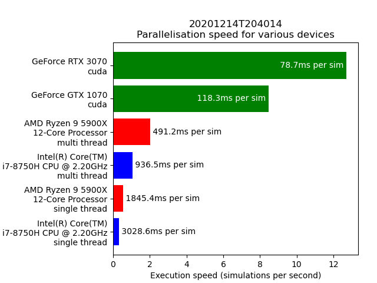
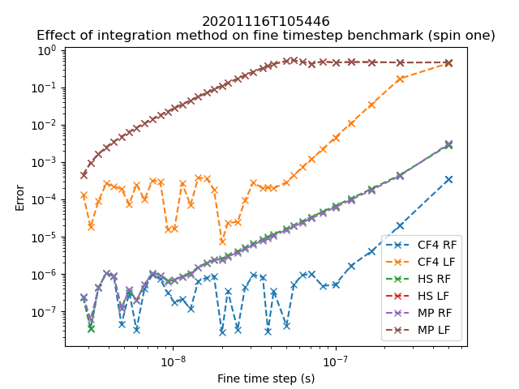
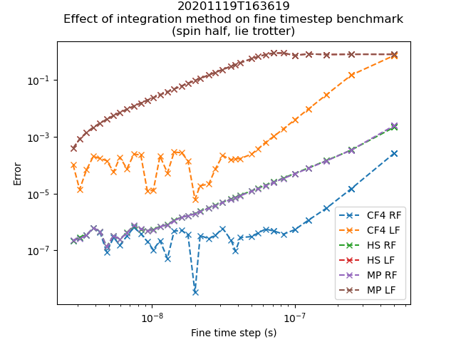
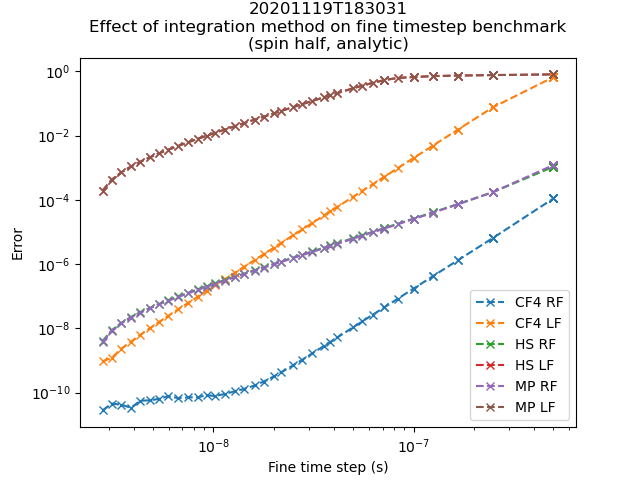

Quality control
===============

.. _benchmark:

Benchmarks
----------

Speed
.....

Benchmarks were performed using :mod:`neural-sense.sim.benchmark`, by comparing evaluation speed of typical spin one metrology experiments on different devices. This is shown in :numref:`fig_benchmark_device_aggregate`. The integration code was compiled by :mod:`numba` for single core CPUs, multicore CPUs, and Nvidia Cuda, and run on different devices. These devices are,

* Intel Core i7-8750H, a 6 core laptop processor released in 2018. Run with 16GiB of RAM.
* AMD Ryzen 9 5900X, a 12 core desktop processor released in 2020. Run with 32GiB of RAM.
* Nvidia GeForce GTX 1070, a 2048 cuda core laptop graphics processor released in 2016. Run with 8GiB of VRAM.
* Nvidia GeForce RTX 3070, a 5888 cuda core desktop graphics processor released in 2020. Run with 8GiB of VRAM.

.. _fig_benchmark_device_aggregate:

    Evaluation speed of a typical spin one metrology experiment. Fine time step is 100ns, as determined to be ideal by the accuracy experiments below. Experiments run for a duration of 100ms. Evaluation time is determined by an average of 100 similar experiments for each device.

This benchmark shows the benefit to using parallelisation when solving this problem. Moving from a 6 core processor to a 12 core processor doubles the execution speed. Moving from a single core processor to a GPU increases performance by well over an order of magnitude.

Accuracy
........

Benchmarks were performed using :mod:`neural-sense.sim.benchmark`, by comparing state evaluations of many different typical metrology experiments and finding the mean error introduced when the fine (integration) time step is increased.

.. _fig_benchmark_spin_one:

    Fine time step benchmark for spin one systems. CF4 is the Magnus commutator free integrator, HS is the two sample exponential integrator used in :mod:`AtomicPy`, MP is a single sample exponential integrator, RF is use of the rotating frame, and LF is lab frame (no use of the rotating frame). HS and MP results are drawn on top of each other due to their similarities.

:numref:`fig_benchmark_spin_one` shows the performance of :mod:`spinsim` when running in spin one mode. This shows that both using the Magnus based CF4 method and moving into a rotating frame give significant increases to accuracy. The HS (half step) method in the lab frame, with a time step of 10ns was the method used by :mod:`AtomicPy`, the previous code used by the group for simulating spin systems. Compared to this, the best performing :mod:`spinsim` method is 5 orders of magnitude more accurate, while executing in a time 2 orders of magnitude faster.

.. _fig_benchmark_spin_half_lt:

    Fine time step benchmark for spin half systems, using the Lie Trotter based exponentiator. CF4 is the Magnus commutator free integrator, HS is the two sample exponential integrator used in :mod:`AtomicPy`, MP is a single sample exponential integrator, RF is use of the rotating frame, and LF is lab frame (no use of the rotating frame). HS and MP results are drawn on top of each other due to their similarities. Compared to this method, CF4 

From :numref:`fig_benchmark_spin_half_lt`, one gets essentially the same accuracy for each method when working in spin half mode compared to spin one, if all else is kept constant.

.. _fig_benchmark_spin_half_a:

    Fine time step benchmark for spin half systems, using the analytic based exponentiator. CF4 is the Magnus commutator free integrator, HS is the two sample exponential integrator used in :mod:`AtomicPy`, MP is a single sample exponential integrator, RF is use of the rotating frame, and LF is lab frame (no use of the rotating frame). HS and MP results are drawn on top of each other due to their similarities.

:numref:`fig_benchmark_spin_half_a` shows that the Lie Trotter based exponentiator does limit the maximum accuracy obtainable, and for spin half systems, one can increase accuracy further (and decrease execution time) by using an analytic based exponentiator.

Comparison to alternatives
..........................

As mentioned before, compared to our previous code, :mod:`AtomicPy`, the best performing :mod:`spinsim` method is 5 orders of magnitude more accurate, while executing in a time 2 orders of magnitude faster. We had planned to benchmark against some popular generic solvers. One such solver was :func:`qutip.sesolve()`, a solver in the popular quantum mechanics python library, QuTip\ :cite:`johansson_qutip_2013`. However, due to a known bug with the library's dependencies, this was not installable on Windows 10, the operating system being used, and benchmarks could not be run. We also planned to benchmark accuracy against the generic solver :mod:`scipy.integrate.ivp_solve()` in the python library SciPy\ :cite:`virtanen_scipy_2020`. However , using the same `get_field` function as in the spin one benchmarks used for the :mod:`spinsim`, simulating with a fine time step of 500ns (the largest used during the :mod:`spinsim` benchmarks), we found that a single simulation ran in 153s, which is over three orders of magnitude slower than the most accurate :mod:`spinsim` simulations. This means that a generous projection for the time it would take to run the same benchmarks that :mod:`spinsim` runs in 11 minutes, using :mod:`scipy` would be over six days; for an integration package not designed for this problem (and would therefore likely be less accurate).

Testing
-------

The simulator as a whole has been functionally tested against well known analytic approximations of the behaviour spin systems. This was done for every combination of integrator settings possible when compiling the integrator. The system was benchmarked in terms of accuracy vs fine time step, again, using every possible combination of integrator settings. This confirms that no integrator diverges away from the limiting solution when the time step is decreased in magnitude. The Lie Trotter matrix exponentiator was tested separately from the full system, as well as benchmarked separately.

These tests and benchmarks were run as part of the :mod:`neural-sense` package, which is the package that this simulator package was designed to be used for. The simulator has also been used as part of the measurement protocol being developed there, and it has been tested as part of those algorithms as well.

The kernel execution was profiled thoroughly, and changes were made to optimise VRAM and register usage and transfer. This was done specifically for the hardware of an Nvidia GTX1070, so one may get some performance increases by changing some GPU specific metaparameters when instantiating the :class:`spinsim.Simulator` object.

A good way to confirm that :mod:`spinsim` is functioning properly after an installation is to run the tutorial code provided and compare the outputs. Otherwise, one can run the benchmarks and simulation protocols in :mod:`neural-sense.sim.benchmark`.