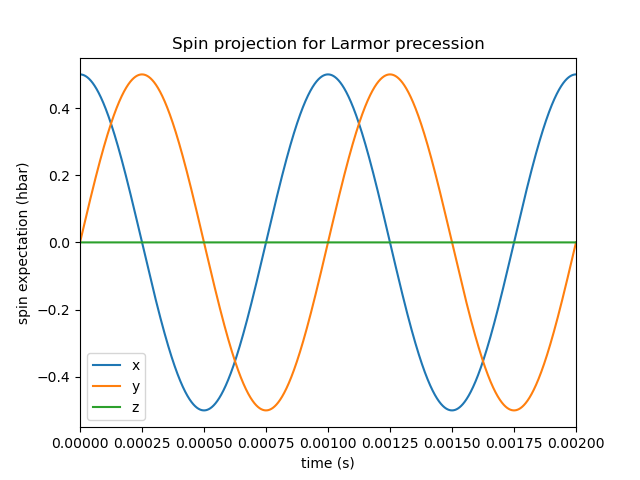
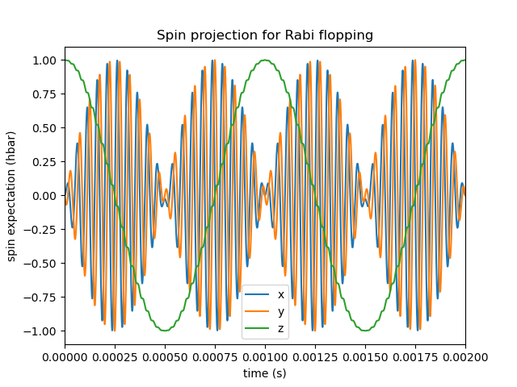
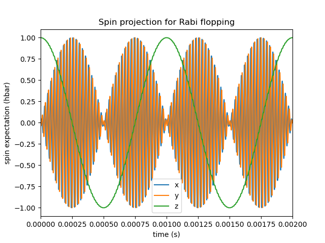

..  documentation master file, created by
   sphinx-quickstart on Thu Nov 12 17:50:03 2020.
   You can adapt this file completely to your liking, but it should at least
   contain the root `toctree` directive.

Welcome to spinsim's documentation!
===================================

.. toctree::
   :maxdepth: 4
   :caption: Contents:

   spinsim

Indices and tables
==================

* :ref:`genindex`
* :ref:`modindex`
* :ref:`search`

Examples of use
===============

Basic example: Spin half Larmor precession
------------------------------------------

The most basic system that :mod:`spinsim` can simulate is that of Larmor precession of a spin half system. Here, the two spin z projection eigenstates are split by a source potential :math:`f_L`, measured in Hz.

.. note::
   The :mod:`spinsim` package takes its conventions from atomic physics, and there are a few things that those from outside the field should be aware of.
   
   Firstly, energies are written in dimensions of frequency, in units of Hz, where the value used is the frequency equivalent to the energy given by the Plank-Einstein relation, :math:`f = \frac{E}{h}`, with :math:`h` being Plank's constant.

   Secondly, the symbol :math:`F` is used to denote the spin of a system in this documentation, which stands for hyperFine spin. This is because this software was written to specifically model the evolution of hyperfine spin.

When the system is initialised in a state of definite spin z projection, it gains a phase over time. However, if the system is started in a superposition of these states, the expected spin projection (Bloch) vector will precess around the :math:`z` axis at a rate of :math:`f_L`.

The first thing we need to do is import the correct packages for the example. As well as :mod:`spinsim` for simulations, we will use :mod:`numpy` to work with arrays, and :mod:`matplotlib.pyplot` to plot our results.

.. code-block:: python

   import spinsim
   import numpy as np
   import matplotlib.pyplot as plt

When set to spin half mode, the :mod:`spinsim` package solves time dependent Schroedinger Equations of the form

.. math::
   \frac{\mathrm{d}}{\mathrm{d}t}\psi(t) = -i 2\pi (f_x(t) F_x + f_y(t) F_y + f_z(t) F_z) \psi(t),

where :math:`i^2 = -1`, :math:`\psi(t) \in \mathbb{C}^2`, and the spin half spin projection operators are given by

.. math::
   \begin{align*}
      F_x &= \frac12\begin{pmatrix}
         0 & 1 \\
         1 & 0
      \end{pmatrix},
      &F_y &= \frac12\begin{pmatrix}
         0 & -i \\
         i &  0
      \end{pmatrix},
      &F_z &= \frac12\begin{pmatrix}
         1 &  0 \\
         0 & -1
      \end{pmatrix}.
   \end{align*}

The source of the system is the collection of energy functions :math:`f_x(t), f_y(t), f_z(t)`, with :math:`t` in units of s and :math:`f` in units of Hz that control the dynamics of the system. The user must define a function that returns a sample of these source functions when a sampling time is input.

To continue with our example, the Larmor system follows a Schroedinger equation of

.. math::
   \frac{\mathrm{d}}{\mathrm{d}t}\psi(t) = -i 2\pi f_L F_z \psi(t),

so

.. math::
   \begin{align*}
      f_x(t) &= 0,&
      f_y(t) &= 0,&
      f_z(t) &= f_L.
   \end{align*}

Let's pick :math:`f_L = 1\mathrm{kHz}`. We can write this as a python function as follows:

.. code-block:: python

   # Define a numba.cuda compatible source sampling function
   def get_source_larmor(time_sample, simulation_index, source_sample):
      source_sample[0] = 0            # Zero source in x direction
      source_sample[1] = 0            # Zero source in y direction
      source_sample[2] = 1000         # Split spin z eigenstates by 1kHz

This function has three inputs. `time_sample` and `source_sample` are the equivalent of :math:`t` and :math:`(f_x, f_y, f_z)` from before. In particular, `source_sample` is a numpy array of doubles, with indices 0, 1, 2 representing for indices :math:`x, y, z` respectively. `simulation_index` is a secondary input to the function, which we will explore in the next example.

We can then use the function :func:`spinsim.time_evolver_factory()` to return an integrator with this specific function built in. This integrator is built using :mod:`numba.cuda`, and runs on a cuda capable gpu.

.. code-block:: python

   # Return a solver which uses this function
   get_time_evolution_larmor = spinsim.time_evolver_factory(\
      get_source_larmor,\
      spinsim.SpinQuantumNumber.HALF\
   )

.. warning::
   Since the source function is built into a cuda kernel using :mod:`numba.cuda`, it must be compatible with the restrictions of :func:`numba.cuda.jit`. As an example, :mod:`math` functions must be used over :mod:`numpy` math functions, as the latter are incompatible.

:func:`spinsim.time_evolver_factory()` contains many options that can be used to customise which features are used by the integrator.

The next step is to define some simulation parameters, as well as the input and output. Firstly, we must decide on some time steps that are to be used. `time_step_coarse` defines the resolution of the output time series for the time evolution operator, state and spin. `time_step_fine` determines the internal time step of the integrator. `time_step_coarse` must be an integer multiple of `time_step_fine`. We also need to define the times when the experiment starts and ends. Below we have chosen to have a `time_step_fine` of 10ns, a `time_step_coarse` of 100ns, a start time of 0ms, and an end time of 100ms.

.. code-block:: python

   # The resultion of the output of the simulation is 100ns
   time_step_coarse = 100e-9
   # The resultion of the integration in the simulation is 10ns
   time_step_fine = 10e-9
   # Run between times of 0ms and 100ms.
   time_end_points = np.asarray([0e-3, 100e-3], np.double)

We also need to define an array of times for when each of the time series are sampled.

.. code-block:: python

   # The number of samples in the output
   time_index_max = int((time_end_points[1] - time_end_points[0])/time_step_coarse)
   # Define an empty array to write the time to
   time = np.empty(time_index_max, np.double)

Next we define empty arrays for the state of the system (wavefunction), as well as its expected spin (Bloch vector), and the time evolution operator between each sample. Here the time index is the furthest to the left. We also define an initial state. We choose an eigenstate of the :math:`F_x` operator, as we expect that to precess as it evolves through time.

.. code-block:: python

   # Define the initial state of the system (eigenstate of spin x)
   state_init = np.asarray([1/np.sqrt(2), 1/np.sqrt(2)], np.cdouble)
   # Define an empty array to write the state to
   state = np.empty((time_index_max, 2), np.cdouble)
   # Define an empty array to write the spin to
   spin = np.empty((time_index_max, 3), np.double)
   # Define an empty array to write the time evolution operator to
   time_evolution = np.empty((time_index_max, 2, 2), np.cdouble)

Finally, we calculate some parameters that need to be given when the gpu kernel `get_time_evolution_larmor` is executed, just so that the right number of threads are created on the gpu. One can use this as boiler plate code at first, but changing `threads_per_block` can be used to optimise performance to an extent. This means that there will be enough gpu threads executed to calculate a time evolution operator for every sample time step, in parallel, on the gpu. 

.. code-block:: python

   # Set up the gpu to have blocks of size 64
   threads_per_block = 64
   blocks_per_grid = (time_index_max + (threads_per_block - 1)) // threads_per_block

.. note::
   The reason these are needed is because of the structure of how threads are run on a gpu. Instructions on a gpu are run simultaneously for 32 threads at a time, and this group of 32 threads in hardware is called a warp. Many warps can be loaded onto and run on a gpu at once. All threads in a warp are chosen from the same block, which is the software abstraction of a warp. All blocks must contain the same number of threads. Blocks are then organised into a structure called a grid. So when a cuda kernel, like the one compiled by :func:`spinsim.time_evolver_factory()` is executed, the gpu must be told how many threads are in each block (`threads_per_block`), and the total number of blocks that are to be executed (`blocks_per_grid`).

Now that everything is set up, the time evolution operator can be found between each sample using our generated function `get_time_evolution_larmor`.

.. code-block:: python

   # Find the time evolution operator using our settings
   get_time_evolution_larmor[blocks_per_grid, threads_per_block](\
      0,\
      time,\
      time_end_points,\
      time_step_fine,\
      time_step_coarse,\
      time_evolution\
   )

Now that we have the time evolution operator, we can use it to find the state at each point in time. This is done with a regular :func:`numba.jit()`ed function.

.. code-block:: python

   # Chain the time evolution operators together to find the state at each point in time
   spinsim.get_state(state_init, state, time_evolution)

And finally, we can calculate the expected spin of the system, in parallel, on the gpu.

.. code-block:: python

   # Calculate the spin at each point in time
   spinsim.get_spin[blocks_per_grid, threads_per_block](state, spin)

Has this worked? We can plot the results using :mod:`matplotlib.pyplot` (zoomed in to show details),

.. code-block:: python

   # Plot result
   plt.figure()
   plt.plot(time, spin)
   plt.legend(["x", "y", "z"])
   plt.xlim(0e-3, 2e-3)
   plt.xlabel("time (s)")
   plt.ylabel("spin expectation (hbar)")
   plt.title("Spin projection for Larmor precession")
   plt.show()

which results in

Here we see that indeed, the bloch vector is precessing anticlockwise at a frequency of 1kHz around the positive z axis.

More advanced example: Spin one Rabi flopping
---------------------------------------------

Now that we have confirmed that the most basic quantum system can be simulated using :mod:`spinsim`, we can explore the more advanced, and more optimised ways it can be used. For a start, :mod:`spinsim` was designed for use simulating spin one systems, so we should try that out. Also to note is that many of the ways of doing things with memory in the basic example were very sub-optimal, so we should look at ways to fix that.

Again, we import some packages, with some new ones that will be explained later.

.. code-block:: python

   import spinsim.spinsim as spinsim

   import numpy as np
   import matplotlib.pyplot as plt

   import math
   from numba import cuda

Let's first introduce the Rabi system. As before, we split the energy levels of the spin system (which is now three levels), with an energy difference :math:`f_L` between each consecutive level. Again, if started in an eigenstate of :math:`F_x`, the expected spin will precess anticlockwise around the positive z axis. Radiation can be applied to the system to drive transitions between the spin states. For this to work, radiation must be resonant (or close to resonant) with the energy splitting (ie, its frequency of oscillation must be close to :math:`f_L`). If the system starts with the expected spin pointing completely up, this radiation will drive the system to point completely down. It will then drive the system back up, and the cycle repeats. This happens at a rate of half of the amplitude of the radiation (assuming perfect resonance), which is called the Rabi frequency :math:`f_R`, and the cycling is called Rabi flopping. The Schroedinger equation of the Rabi system is

.. math::
   \frac{\mathrm{d}}{\mathrm{d}t}\psi(t) = -i 2\pi (2 f_R \cos(2\pi f_L t) F_x + f_L F_z) \psi(t).

In general, :mod:`spinsim` can solve Schroedinger equations of the form

.. math::
   \frac{\mathrm{d}}{\mathrm{d}t}\psi(t) = -i 2\pi (f_x(t) F_x + f_y(t) F_y + f_z(t) F_z + f_q(t) F_q) \psi(t).

where now :math:`\psi(t) \in \mathbb{C}^3`, and the spin one operators are given by

.. math::
   \begin{align*}
      F_x &= \frac{1}{\sqrt{2}}\begin{pmatrix}
         0 & 1 & 0 \\
         1 & 0 & 1 \\
         0 & 1 & 0
      \end{pmatrix},&
      F_y &= \frac{1}{\sqrt{2}}\begin{pmatrix}
         0 & -i &  0 \\
         i &  0 & -i \\
         0 &  i &  0
      \end{pmatrix},\\
      F_z &= \begin{pmatrix}
         1 & 0 &  0 \\
         0 & 0 &  0 \\
         0 & 0 & -1
      \end{pmatrix},&
      F_q &= \frac{1}{3}\begin{pmatrix}
         1 &  0 & 0 \\
         0 & -2 & 0 \\
         0 &  0 & 1
      \end{pmatrix}.
   \end{align*}

:math:`F_x, F_y, F_z` are regular spin operators, and :math:`F_q` is a quadratic operator, proportional to :math:`Q_{zz}` and :math:`Q_0` as defined by other papers.

Just as before, we must define a source function, this time being time dependent.

.. code-block:: python

   def get_source_rabi(time_sample, simulation_index, source_sample):
    # Dress atoms from the x direction, Rabi flopping at 1kHz
    source_sample[0] = 2000*math.cos(math.tau*20e3*time_sample)
    source_sample[1] = 0      # Zero source in y direction
    source_sample[2] = 20e3   # Split spin z eigenstates by 20kHz
    source_sample[3] = 0      # Zero quadratic shift, found in spin one systems

This time there is a fourth entry in `source_sample`, which represents the quadrtic shift :math:`f_q(t)`. Here we have chosen a Larmor frequency :math:`f_L` of 20kHz, and a Rabi frequency :math:`f_R` of 1kHz.

.. warning::
   Remember, these functions must be :func:`numba.cuda.jit()` compilable. The following code will not work due to the use of :mod:`numpy` functions and constants:

   .. code-block:: python

      def get_source_rabi(time_sample, simulation_index, source_sample):
      # Dress atoms from the x direction, Rabi flopping at 1kHz
      source_sample[0] = 2000*np.cos(np.tau*20e3*time_sample)
      source_sample[1] = 0       # Zero source in y direction
      source_sample[2] = 20e3    # Split spin z eigenstates by 20kHz
      source_sample[3] = 0       # Zero quadratic shift, found in spin one systems

Before we move on, suppose that we want to execute multiple similar simulations. For example, we could run the current simulation, then one that is exactly the same, but with double the Larmor frequency :math:`f_L`. One could do this by hard coding another source function with this change and then compiling another solver, but this takes time and is inefficient. Instead, we can use the parameter `simulation_index`.

.. code-block:: python

   def get_source_rabi(time_sample, simulation_index, source_sample):
      # Dress atoms from the x direction, Rabi flopping at 1kHz
      source_sample[0] = 2000*math.cos(math.tau*20e3*simulation_index*time_sample)
      source_sample[1] = 0                        # Zero source in y direction
      source_sample[2] = 20e3*simulation_index    # Split spin z eigenstates by 20kHz
      source_sample[3] = 0                        # Zero quadratic shift

The value of each `simulation_index` can be input whenever the integration function is called. In general, this can be used to sweep through values for any number of simulations, saving compile time.

Let's build our function, now spin one.

.. code-block:: python

   # Return a solver which uses this function
   get_time_evolution_rabi = spinsim.time_evolver_factory(\
      get_source_rabi,\
      spinsim.SpinQuantumNumber.ONE\
   )

We set up some of the parameters as before, but can make some optimisations for the others.

.. code-block:: python

   # The resultion of the output of the simulation is 100ns
   time_step_coarse = 100e-9
   # The resultion of the integration in the simulation is 10ns
   time_step_fine = 10e-9
   # Run between times of 0ms and 100ms.
   time_end_points = np.asarray([0e-3, 100e-3], np.double)

   # The number of samples in the output
   time_index_max = int((time_end_points[1] - time_end_points[0])/time_step_coarse)

   # Define the initial state of the system (eigenstate of spin z)
   state_init = np.asarray([1, 0, 0], np.cdouble)
   # Define an empty array to write the state to
   state = np.empty((time_index_max, 3), np.cdouble)

   # Set up the gpu to have threads of size 64
   threads_per_block = 64
   blocks_per_grid = (time_index_max + (threads_per_block - 1)) // threads_per_block

Another unnecessary thing we were doing before, is copying memory to and from the gpu. For example, we never use `time_evolution`, `time`, or `spin` before they are loaded onto the gpu for evaluation. This means that declaring them as empty in cpu memory, only to copy the empty (junk) array to gpu memory for execution is a waste of time. A way to get around this is to use :func:`numba.cuda.device_array()` to declare the array directly in gpu memory.

.. code-block:: python

   # Define an empty array directly on the gpu to write the time evolution operator to
   time_evolution = cuda.device_array((time_index_max, 3, 3), np.cdouble)
   # Define an empty array directly on the gpu to write the time to
   time = cuda.device_array(time_index_max, np.double)
   # Define an empty array directly on the gpu to write the spin to
   spin = cuda.device_array((time_index_max, 3), np.double)

.. warning::
   As we will soon see, declaring arrays in gpu memory will mean they are no longer automatically copied to cpu memory at the end of the simulation. Thus, :func:`numba.cuda.cudadrv.devicearray.DeviceNDArray.copy_to_host()` (a class method) must be used on the these arrays in order to manipulate them in cpu memory.

We are now ready to execute. There are a few things to note. Firstly, `simulation_index` is the first parameter. Here it is set to 1 for a Larmor frequency of :math:`20kHz`. Also, using :func:`numba.cuda.to_device()` on arrays will mean that they are not returned, saving time when copying values from gpu memory to cpu memory.

.. code-block:: python

   # Find the time evolution operator using our settings
   get_time_evolution_rabi[blocks_per_grid, threads_per_block](\
      1,\
      time,\
      cuda.to_device(time_end_points),\
      time_step_fine,\
      time_step_coarse,\
      time_evolution\
   )

As mentioned earlier, we must manually retrieve `time` and `time_evolution`.

.. code-block:: python

   # Get arrays off the gpu
   time = time.copy_to_host()
   time_evolution = time_evolution.copy_to_host()

The same steps as  before can be made to obtain the final spin. Similar memory optimisations to before have been made here as well.

.. code-block:: python

   # Chain the time evolution operators together to find the state at each point in time
   spinsim.get_state(state_init, state, time_evolution)

   # Calculate the spin at each point in time
   spinsim.get_spin[blocks_per_grid, threads_per_block](cuda.to_device(state), spin)

   # Get spin off the gpu
   spin = spin.copy_to_host()

Finally we can plot our results.

.. code-block:: python

   # Plot result
   plt.figure()
   plt.plot(time, spin)
   plt.legend(["x", "y", "z"])
   plt.xlim(0e-3, 2e-3)
   plt.xlabel("time (s)")
   plt.ylabel("spin expectation (hbar)")
   plt.title("Spin projection for Rabi flopping")
   plt.show()

which gives

Notice the spin z projection cycling (Rabi flopping) at a rate of 1KHz, while the spin x and y projections are cycling between each other (Larmor precessing) at a rate of 20kHz. Using the rotating wave approximation, the spin z projection can be thought of as a sine wave. However, when these approximations are not used, one obtains these artifacts that we see on the spin z projection, known as beyond rotating wave effects.

Finally, let's run another experiment using the same compiled function. This will run faster than last time, as it does not need to be compiled a second time. Notice that here we set `simulation_index` to 2, which should double the Larmor frequency :math:`f_L`.

.. code-block:: python

   # Define an empty array directly on the gpu to write the time evolution operator to
   time_evolution = cuda.device_array((time_index_max, 3, 3), np.cdouble)
   # Define an empty array directly on the gpu to write the time to
   time = cuda.device_array(time_index_max, np.double)
   # Define an empty array directly on the gpu to write the spin to
   spin = cuda.device_array((time_index_max, 3), np.double)

   # Find the time evolution operator using our settings
   get_time_evolution_rabi[blocks_per_grid, threads_per_block](
      2,\
      time,\
      cuda.to_device(time_end_points),\
      time_step_fine,\
      time_step_coarse,\
      time_evolution\
   )

   # Get arrays off the gpu
   time = time.copy_to_host()
   time_evolution = time_evolution.copy_to_host()

   # Chain the time evolution operators together to find the state at each point in time
   spinsim.get_state(state_init, state, time_evolution)

   # Calculate the spin at each point in time
   spinsim.get_spin[blocks_per_grid, threads_per_block](cuda.to_device(state), spin)

   # Get spin off the gpu
   spin = spin.copy_to_host()

   # Plot result
   plt.figure()
   plt.plot(time, spin)
   plt.legend(["x", "y", "z"])
   plt.xlim(0e-3, 2e-3)
   plt.xlabel("time (s)")
   plt.ylabel("spin expectation (hbar)")
   plt.title("Spin projection for Rabi flopping")
   plt.show()

which results in

See that the spin projections are similar to last time, except that the Larmor precession is now at 40KHz.